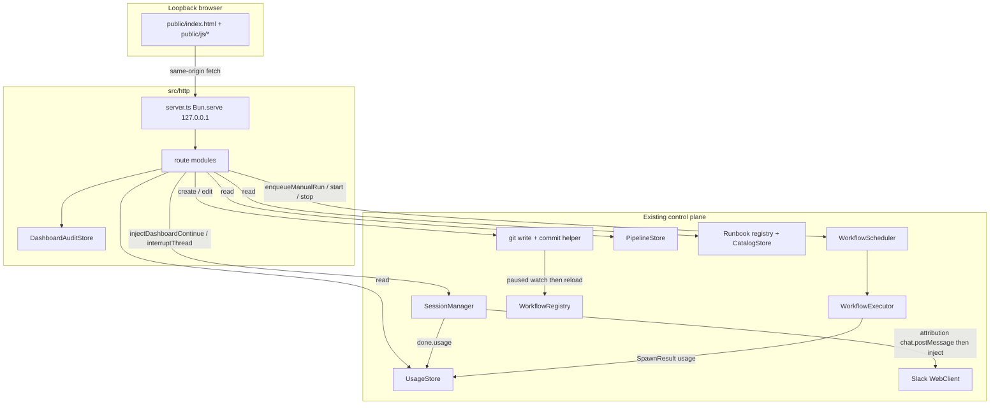
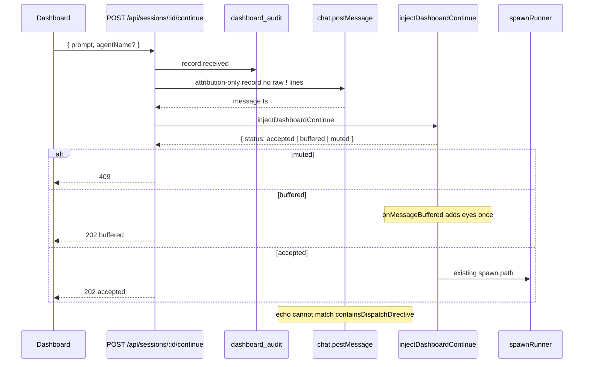
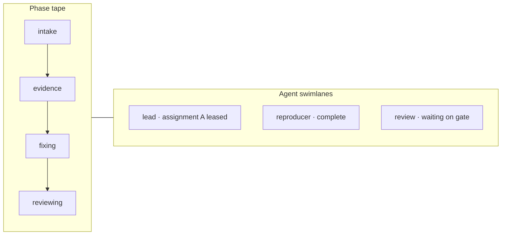

# Junior Operator Dashboard Redesign

| Field | Value |
|---|---|
| **Title** | Redesign Junior's HTML dashboard, HTTP API, and supporting codebase |
| **Author** | Junior dashboard redesign |
| **Date** | 2026-08-15 |
| **Status** | Draft |
| **Supersedes** | `docs/features/http-dashboard.md` cut list item "Write endpoints stay read-only". The localhost dashboard becomes a first-class operator control surface. Session continue/stop post to the Slack thread (parity with `!` commands). Workflow mutations write `dashboard_audit` and a git commit; they post to a workflow Slack output channel when one exists, and are otherwise an accepted weaker trail than Slack (loopback-only identity). |

---

## Overview

The localhost dashboard (`HTTP_DASHBOARD_PORT`, binds `127.0.0.1`) is a trusted-operator console. Today it is almost entirely read-only: sessions list + a Slack permalink, a copy-paste resume CLI command, a thin workflow card list, a 3D pipeline dispatch graph that omits leases / artifacts / blockers / gates, no spend ledger, and no runbook browser. Mutations go through Slack so they stay auditable.

This redesign keeps the loopback threat model and the existing control plane. It adds five operator capabilities — continue a session, inspect a live pipeline, query token/cost spend, trigger/edit/create Git-backed workflows, and view runbooks — by extending the existing Bun HTTP server, session manager, workflow controller, pipeline store, and runbook registry. Dashboard-originated turns go through a new `SessionManager.injectDashboardContinue` that resolves the `junior`/`default`/`lead` alias, skips default-run hijack, and returns `{ accepted | buffered | muted }` — it does not call `handleAgentMessage("junior")` and does not invent a fire-and-forget result from void `handle*` methods. Workflow **trigger** uses a new `WorkflowScheduler.enqueueManualRun` (because `runNow` awaits the whole executor). Creates and edits write `*.workflow.md` files and make a scoped git commit only on a named branch. Every mutating call writes a durable audit row.

The UI stays a no-build vanilla operator console. `public/index.html` is already 4,374 lines / 180 KB; this work splits it into a small set of same-origin JS modules. Three.js memory galaxy and the existing pipeline worker keep working.

---

## Background & Motivation

### Current state (verified 2026-08-15, `main` @ `77076fe`)

| Surface | What exists | Gap |
|---|---|---|
| HTTP server | `src/http/server.ts` — `Bun.serve` on `127.0.0.1`, no CORS, no auth | All routes are GET. `HttpServerDeps` has stores/registries but not `SessionManager`, Slack client, workflow controller, or runbook registry. |
| Sessions API | `GET /api/sessions`, `GET /api/sessions/:threadId` | List uses a denylist spread (`...rest`) so `activeTurnInput` (live prompt body) and other new fields leak. List `agents[]` still emits `pid`. Detail returns the raw `ThreadSession` (pending bodies, `systemPrompt`, paths). Drawer in `public/index.html` depends on `worktreePath` / `cwd` / `agentSessions` / array `pendingMessages`. |
| Continue path | Slack events → `SessionManager`; pipeline pump and MCP `agent_dispatch` already inject synthetic `SlackMessageEvent`s | No HTTP inject. Dashboard cannot start a turn. |
| Pipelines API | `GET /api/pipelines`, `GET /api/pipelines/:id` via `src/http/routes/pipelines.ts` | Detail projects assignments + latest dispatch + outcomes + phase transitions. Omits leases, artifact refs, gates, GitHub resources, full outbox, blockers, acceptance criteria, attempts. Feature doc is stale (pipelines routes are not listed). |
| Pipeline UI | 3D Three.js graph + rail in `public/index.html` (`renderPipelines`, `public/pipeline-worker.js`) | Topology-only. Operator cannot answer "who holds the lease", "what is blocked", "which artifact/gate failed", or "what is the phase history". |
| Spend | `RunnerEventDone.usage?: Record<string, unknown>` from Claude (`total_cost_usd`, `usage`, `num_turns`), Codex (`input_tokens`/`output_tokens`), OpenCode CLI/SDK (`tokens` / `{input,output}`) | Usage dies with the process. No SQLite table, no aggregation, no dashboard view. |
| Workflows | `GET /api/workflows` + Slack `!workflow run/start/stop/reload` | Read-only HTTP. Definitions are Git-backed markdown (`workflows/*.workflow.md`, overlay `agents-org/workflows/*.workflow.md`). |
| Runbooks | Registry + MCP (`runbook_search`/`get`/`select`) + `CatalogStore` (`data/runbooks.db`) + files under `agents-org/runbooks/` | No HTTP surface. Dashboard cannot browse them. |
| Audit | Slack thread is the conversation of record for human `!` commands | No durable dashboard audit. Adding writes without one would be weaker than Slack. |

### Pain points

1. Operator SSHs in, copies a resume command, and leaves Slack. The thread is no longer the conversation of record.
2. A live product/bug run cannot be understood from the current graph: leases, outbox retries, blockers, and artifacts are invisible.
3. Token/cost questions ("what did today cost?", "which pipeline burned the budget?") cannot be answered after the process exits.
4. Workflow edits require a text editor + git + `!workflow reload`. Creating a workflow from the console is out of scope of the current cut list.
5. Runbooks already exist as reviewed Git artifacts but are invisible outside MCP.

### Constraints this design will not violate

- Loopback-only. No OAuth. Same-origin. No CORS.
- Provider boundary: HTTP never spawns a CLI.
- Buffer, don't interrupt. Stop/interrupt reuses `SessionManager` `!stop` / `!cancel`.
- Durable stores are authoritative.
- Worktrees only for target repos. Dashboard continue does not set `targetRepo`.
- Workflows stay Git-backed markdown. Runbooks stay a separate registry.
- Path-traversal guards stay reject-early.
- Profiles and pending-message bodies do not leak.

---

## Goals & Non-Goals

### Goals

1. First-class **continue-session** from the dashboard through `SessionManager` + the selected runner provider, with the Slack thread remaining the conversation of record.
2. A **pipeline operator surface** that shows typed runs, assignments, leases, outbox, outcomes, artifacts, gates, GitHub resources, current stage, who is working, blockers, and history.
3. A **durable spend ledger** sourced from runner `done` events, queryable by day / session / agent / provider / workflow / pipeline.
4. Dashboard **workflow run / edit / create**, persisted as scoped git commits, respecting overlay precedence, validation, owner/admin rules, `enabled`, concurrency, and native-handler vs runner workflows.
5. Dashboard **runbook viewer** (definition, frontmatter, body, Git provenance, catalogue metrics). Authoring/PRs later.
6. **Audit log** for every mutating dashboard action (who / what / when / result). Session continue/stop also post to the Slack thread. Workflow mutations post to a Slack output channel when the definition has one; otherwise git + `dashboard_audit` is an accepted weaker trail.
7. Keep memory galaxy, docs, logs, profiles, and dev-server views working.

### Non-Goals

- Binding the dashboard off loopback, or adding token/OAuth auth.
- Server-Sent Events / WebSockets. Polling stays.
- A frontend framework or build step.
- Dashboard-authored runbooks, runbook PRs, or merging runbooks into the workflow registry.
- Multi-step workflow DAGs, retry-failed-run UI, or workflow secrets.
- Starting new Slack threads from the dashboard (continue existing sessions only).
- Killing worktrees, evicting dev-server slots, or `!reset all` from the dashboard (v1).
- Pushing commits or opening PRs automatically.
- Per-thread pending-message body viewer.
- Accurate dollar cost for providers that do not emit cost (tokens are recorded; `costUsd` is set only from Claude `total_cost_usd`; `costEstimatedUsd` is always null; no `rates.ts`).

---

## Proposed Design

### Architecture



Dashboard writes never invent a second session/workflow/pipeline runtime. They call the same functions Slack already calls.

### Information architecture

Keep the existing left nav. Add two items. Do not merge workflows and runbooks.

| Nav | Purpose |
|---|---|
| Overview | Attention cards + today's spend + open pipeline count + existing stats |
| Threads | Session list + drawer with **Continue** composer, stop, Slack link, resume CLI (kept) |
| Logs | Unchanged |
| Dev Servers | Unchanged |
| Workflows | List + detail/editor + run + git provenance |
| Pipelines | List + **swimlane/timeline** detail (3D topology becomes a toggle) |
| Runbooks | **New.** Browse/view only |
| Spend | **New.** Ledger + slices |
| Profiles | Unchanged |
| Memory | Unchanged Three.js galaxy |
| Docs | Unchanged |
| Audit | **New.** Filterable dashboard audit log (operator-only, loopback) |

Empty / error / busy conventions stay: `.empty` copy, `safeFetch` error banners, nav counts, 2s poll. Mutating actions disable the button, show in-flight state, and refresh the owning view on settle.

### Frontend split (no framework)

`public/index.html` is already too large for one more feature area. Split vanilla JS, no bundler:

```
public/
  index.html                 shell, CSS, nav, view mounts
  pipeline-worker.js         keep (3D layout worker)
  js/
    api.js                   safeFetch, poll, error toast
    app.js                   hash router, nav, overview
    threads.js               list, drawer, continue/stop
    pipelines.js             list + swimlane + optional 3D
    workflows.js             list, editor, run, git status
    runbooks.js              list + viewer
    spend.js                 KPI + groupBy table + chips (no canvas chart)
    audit.js                 audit table
    markdown.js              existing md renderer extracted
    galaxy.js                existing Three.js memory scene
```

`src/http/server.ts` serves `/js/*` and `/assets/*` from `public/` with `text/javascript`, `Cache-Control: no-cache`. Keep `/assets/three.*.js` and `/assets/pipeline-worker.js`. PR 2 updates `resumeCmd` in `index.html` to use `resumeCwd`. PR 3a moves it to `js/threads.js` and points `dashboard-html.test.ts` at that file.

Three.js galaxy stays a full-viewport scene in `#memory`. Pipeline 3D stays behind a "Topology" toggle so the existing worker is not deleted.

---

## 1. Continue a session

### Control-plane path (do not spawn from HTTP)

Pipeline dispatch (`src/pipelines/dispatch.ts`) and MCP `agent_dispatch` already inject a synthetic `SlackMessageEvent`. Slack's event handler drops self-bot posts (`src/slack/events.ts`) **only when** the text has no line matching `^!<persistent-agent>` (`containsDispatchDirective`). If the Slack record contains a raw operator line such as `!review …`, the echo is admitted. `AgentDispatcher` then treats `botUsername: "dashboard"` as an unknown worker and, in a support channel, forwards to `handleLeadMessage` (`src/support/router.ts` ~261–272) **in addition to** the HTTP inject.

Therefore:

1. The dashboard **must not** rely on Slack echoing the posted message.
2. The Slack record **must not** contain any line that can match `^!(\S+)`. Do not put the raw operator prompt on Slack. Post a short attribution-only record (optional one-line preview with every line prefixed by `> ` so `^!` cannot match).
3. Inject the **raw** prompt via a dedicated `SessionManager` method. Do not assume `dedupeKey: dashboard:…` collides with the Event API key (`event.ts` uses `ts` / `ts:agentName`).
4. Add an explicit Event API drop for posts whose text starts with `*Dashboard continue*` as defense in depth, but the Slack body rule is the primary invariant.



### Dedicated inject API (required)

`handleMessage` / `handleLeadMessage` / `handleAgentMessage` return `Promise<void>`. HTTP cannot honestly emit `{ status: "buffered" | "accepted" }` from them, and a post-hoc read of `pendingMessages` races with drain. Extract:

```ts
// src/session/manager.ts
export type DashboardInjectResult =
  | { status: "accepted" }
  | { status: "buffered" }
  | { status: "muted" };

async injectDashboardContinue(input: {
  threadId: string;
  channel: string;
  prompt: string;
  agentName?: string;
  actorSlackUserId: string;
  postedTs: string;
}): Promise<DashboardInjectResult>
```

`!stop` is refactored to call the same `interruptThread(threadId): Promise<number>` used by HTTP. `getSession` already exists (`src/session/manager.ts` ~793).

### Event shape and invariants

```ts
// src/session/inject.ts
export function toDashboardSlackEvent(input: {
  threadId: string;
  channel: string;
  prompt: string;
  actorSlackUserId: string;
  postedTs: string;
}): SlackMessageEvent {
  return {
    threadId: input.threadId,
    channel: input.channel,
    user: input.actorSlackUserId,
    attributionUserId: input.actorSlackUserId, // drain attribution only
    text: input.prompt,                         // raw prompt, never the Slack record
    conversationalText: input.prompt,
    ts: input.postedTs,
    command: null,
    isSelfBot: true,
    botUsername: "dashboard",
    dedupeKey: `dashboard:${input.threadId}:${input.postedTs}`,
    dashboardContinue: true,                    // new flag on SlackMessageEvent
  };
}
```

`dashboardContinue: true` is checked in two places:

1. `routeDirectTaskThroughDefaultRun` returns `false` immediately. Without this, `PIPELINE_RUNTIME_MODE=active` plus `session.activeRunId` converts the continue into a typed assignment/outbox wake (`src/session/manager.ts` ~3620–3689) and the HTTP handler would report accepted while no runner spawned on that prompt.
2. `evaluateBusyFollowup` treats incoming as ineligible (`incoming-is-internal` / new `incoming-is-dashboard-continue`). Dashboard continue **never** takes the short-followup interrupt path, even when `SESSION_SHORT_FOLLOWUP_INTERRUPT_ENABLED=true`. Setting `attributionUserId` would otherwise make `isInternal` false (`isSelfBot && !attributionUserId` at `manager.ts` ~649).

Do **not** add a second eyes reaction in the HTTP route. `onMessageBuffered` in `src/index.ts` already reacts.

### Agent resolver (closed)

`ThreadSession.defaultAgent` is `"junior" | "lead" | null` (`src/session/types.ts`). `handleAgentMessage` only short-circuits `"lead"` and `"default"` (`manager.ts` 508–515). `"junior"` is an orchestrator alias (`ORCHESTRATOR_AGENTS`) but **not** a `runSingleSession` key. Passing `"junior"` into `handleAgentMessage` creates `agentSessions.junior` and takes the worker path.

```ts
export type ContinueRoute =
  | { kind: "top-level"; handle: "default" | "lead" }
  | { kind: "worker"; agentName: string };

export function resolveContinueRoute(
  requested: string | undefined,
  session: ThreadSession,
): ContinueRoute | { error: "unknown-agent" } {
  const raw = requested ?? session.defaultAgent ?? session.activeAgentName ?? "default";
  if (raw === "lead") return { kind: "top-level", handle: "lead" };
  if (raw === "default" || raw === "junior") return { kind: "top-level", handle: "default" };
  // v1 allow-list: only workers that already have an agentSessions row
  if (session.agentSessions?.[raw]) return { kind: "worker", agentName: raw };
  return { error: "unknown-agent" };
}
```

- `"junior"` is **never** passed to `handleAgentMessage`.
- v1 does **not** allow continuing a worker that is not already on the thread. MCP `agent_dispatch` is not a precedent for a human dashboard continue (signed run context, usually a typed successor).
- Unknown / not-on-thread names → 400 **before** Slack post.

`injectDashboardContinue` then calls `handleMessage` / `handleLeadMessage` / `handleAgentMessage` internally and returns the buffer/accept/mute result from the same mutation that those methods already compute.

### Slack record (conversation of record)

Do **not** use `SlackResponder.postResponse`. It runs `prepareSlackResponse` (can drop the whole post on `NO_SLACK_MESSAGE` and return `[]`) and `splitResponse` at `DEFAULT_MAX_LENGTH = 4000` (`src/slack/formatting.ts`). An 8000-char prompt would become two timestamps; “post failed → 502” would be undefined for split/suppressed posts.

Use raw `app.client.chat.postMessage` for a **short** attribution record only:

```
*Dashboard continue* · local operator · <@{actorSlackUserId} or `dashboard-operator`>
> <first 240 chars of prompt, every line prefixed with `> `, newlines flattened to ` · `>
```

Rules:

- Slack body contains no line matching `^!(\S+)`.
- Injected `text` is the full unsanitized prompt. Cap is **8,000 characters** (`CONTINUE_PROMPT_MAX = 8000`). The cap applies to the injected prompt, not the Slack attribution record (Open Question 4, closed).
- 502 `{ error: "slack post failed" }` means **zero** messages posted. Do not inject.
- Identity: Junior bot (no fake human). Drain attribution uses `attributionUserId`.

### Busy / muted / dormant / missing

| Condition | HTTP | Slack | Session manager |
|---|---|---|---|
| Unknown `threadId` | 404 | nothing | nothing |
| Empty / > 8000 char prompt | 400 | nothing | nothing |
| Unknown / not-on-thread agent | 400 | nothing | nothing |
| `session.muted` | 409 `{ error: "session muted" }` | nothing | `injectDashboardContinue` returns `muted` if called; HTTP checks first |
| `session.dormant` | 202, continue proceeds | attribution post + inject | clear `dormant` **and** set `needsThreadCatchup = true` (same as `!listen` / @mention at `manager.ts` ~416–420) before dispatch |
| Agent `busy` | 202 `{ status: "buffered" }` | attribution post; eyes from `onMessageBuffered` only | `injectDashboardContinue` returns `buffered`. Short-followup cannot interrupt. |
| Agent idle | 202 `{ status: "accepted" }` | attribution post | spawn |
| Slack post fails | 502 | — | **do not inject** |
| `PIPELINE_RUNTIME_MODE=active` + `activeRunId` | 202 accepted/buffered | attribution post | `dashboardContinue` skips `routeDirectTaskThroughDefaultRun`. Does not create/steal assignments. |

Do not offer "continue" on a session with no `channel` / `threadId`. Do not change `targetRepo` / worktrees.

### Optional stop / interrupt

`POST /api/sessions/:threadId/stop` calls `interruptThread` (the extracted `!stop` body: driver `interrupt` + `handle.kill`, keep session). Then **post the same Slack reply `!stop` posts** (`"Nothing running."` / `"Interrupted (N agents). Send a new message to continue."`) to the thread via raw `chat.postMessage`, and store that `slack_ts` on the audit row. Do **not** implement a second kill path. `!cancel` stays Slack-only in v1.

### Session API changes

`GET /api/sessions/:threadId` today returns the raw `ThreadSession`. `public/index.html` (~2128–2182) depends on `t.worktreePath`, `t.cwd`, `t.agentSessions` (not `agents[]`), and `pendingCount` accepting an array. `resumeCmd` uses `t.worktreePath || t.cwd`. The list projector’s `...rest` still serializes `activeTurnInput` (live prompt body) and list `agents[]` still emits `pid`.

**The allowlist projector and the drawer must land in the same PR.** PR 2 updates `handleSessions` / `handleSessionDetail` **and** the current drawer in `public/index.html` (minimal HTML change). PR 3a then extracts JS with no behavior change.

Shared allowlist (list + detail):

```ts
{
  threadId, channel, provider, sessionId, leadSessionId, status,
  agentType, defaultAgent, activeAgentName, targetRepo, baseRef,
  muted, dormant, verbosity, driverMode, lastActivity, createdAt,
  lastError,                      // type + message only
  pendingMessages: number,        // length, never bodies
  hasWorktree: boolean,           // Boolean(worktreePath || Object.keys(worktreePaths).length)
  resumeCwd: string | null,       // detail only; worktreePath || cwd. Omitted on list.
  agents: [{ agentName, sessionId, status, lastActivity, pendingMessages, provider }],
  slackPermalink,                 // detail only
  spend: { inputTokens, outputTokens, costUsd, turns }
}
```

Explicitly **omit**: `worktreePath`, `worktreePaths`, `cwd`, `pid` (thread and per-agent), `systemPrompt`, `slackIdentity`, pending bodies, `activeTurnInput`, `activeTurnAuthor`, `activePipelineInvocation`, assignment capability envelopes.

Open Question 5 is closed: resume-with-path stays as a dedicated `resumeCwd` on **detail only**. List never emits filesystem paths. `resumeCmd` and `dashboard-html.test.ts` switch to `resumeCwd` in the same PR as the projector.

`pendingCount` in the current HTML already accepts a number or an array; after the projector it only sees a number.

---

## 2. See the pipeline better

### Visualization choice: swimlane + timeline (not 3D-first)

**Pick: assignment swimlane over time, with a phase tape.**

Justification:

- A pipeline is a *state machine over time* plus *concurrent leased work*, not a free-form graph. Operators ask "who is working, since when, what is blocked, what failed the last outcome".
- The current 3D orbit graph (`renderPipelines` / `pipeline-worker.js`) encodes topology (parent → child) but hides leases, outbox retries, gates, and artifacts. It also treats "select a node → agent chat" as the detail surface, which conflates durable outcomes with a conversation.
- Swimlanes map 1:1 onto `assignment.targetAgent` (one lane per distinct target, not per assignment). Multiple assignments for the same agent stack vertically inside the lane, sorted by `createdAt`.
- The existing 3D view is kept as a "Topology" toggle so we do not throw away working WebGL, but it is no longer the default.

#### Swimlane visual contract

| Element | Mapping |
|---|---|
| Lane key | `assignment.targetAgent`. Stable sort: `lead`, `default`, then remaining names A–Z. |
| X domain | `min(createdAt)` of the run (or first assignment) → `max(updatedAt, leaseExpiresAt, now)` across assignments. Missing timestamps fall back to `run.createdAt`. |
| Assignment bar | `x0 = createdAt`, `x1 = updatedAt` if terminal (`completed`/`failed`/`cancelled`), else `now`. A lease tick is drawn at `leaseExpiresAt` when status is `leased`. |
| Colors | `leased` / `pending` = `#4f8cff`; `waiting` / `needs-human` = `#f59e0b`; `completed` = `#22c55e`; `failed` = `#ff3b3b`; `cancelled` / `terminal` = `#666666`. |
| Empty lease | Status `pending` with `leaseOwner == null`: hollow bar, label “unleased”. |
| Phase tape | One cell per `transitions[]` entry, labeled `toPhase`, width proportional to time until the next transition (last cell stretches to now). |
| Pins | Blocker kinds on the assignment bar; `needs-human` run status is an amber pin on the tape. |
| Click | Selects the assignment; the right rail shows objective, lease, dispatch, outcomes, artifact refs, gates for `run.activeAttemptId`. No “agent chat” pane in v1. |
| Empty | “No typed pipeline runs. Default-run durability is hidden unless you enable it.” |



### API: expand projection, do not add a second store

`PipelineStore` already has `listAssignments`, `listEvents`, `listOutbox`, `listOutcomesForRun`, `listGates`, `listRevisionMembers`, `listPipelineGitHubResources`, `listDevServerJobs`. The HTTP projector just does not call most of them.

#### `GET /api/pipelines`

`handlePipelines` today only receives the store. Pass `config.pipeline.runtimeMode` (and the permalink resolver if we add Slack links). Health already exposes `pipeline.runtimeMode` (`src/http/routes/health.ts`); reuse that name — do not add a second `pipelineRuntimeMode` field anywhere.

Query: `status`, `kind`, `limit` (default **50**, max **200**; today hardcoded 100). **New** `includeDefault=1`. Default-kind runs are hidden unless `includeDefault=1` **or** `kind=default` (explicit `kind=default` implies include). `kind` + `includeDefault` together: if `kind` is set it wins; `includeDefault` only affects the unfiltered list.

Response:

```ts
{
  openCount: number,
  runtimeMode: "off" | "shadow" | "active",   // from config, not inferred
  pipelines: Array<{
    id, kind, channelId, threadId, phase, status, ownerAgent,
    repoRefs, activeAttemptId, stateVersion,
    terminalOutcome, terminalReason,
    createdAt, updatedAt,
    openAssignmentCount, assignmentCount,
    blockerCount, lastOutcomeSummary,
    currentWorkers: Array<{ agent: string, assignmentId: string, leaseExpiresAt: number | null }>,
    slackPermalink?: string | null
  }>
}
```

When `PIPELINE_RUNTIME_MODE=off` the store is still constructed (`src/index.ts` always builds it). Return `{ pipelines: [], openCount: 0, runtimeMode: "off" }` if `listRuns` is empty; do **not** 503. Shadow/active behave the same for reads.

#### `GET /api/pipelines/:runId`

Expand `projectPipeline` to:

```ts
{
  pipeline: {
    ...runProjection,                    // existing + acceptanceCriteria, artifactRefs, blockerRefs, deadlineAt
    attempt: {
      id, digest, members: [{ memberKey, repoRef, branch, headSha }]
    } | null,
    assignments: Array<{
      id, parentAssignmentId, sourceAgent, targetAgent, skillRef,
      status, objective, attempt, attemptId, dependsOn,
      artifactRefs, acceptanceCriteria, mutationScope,
      leaseOwner, leaseExpiresAt, deadlineAt,
      createdAt, updatedAt,
      outcomes: [...existing, evidenceRefs, artifactRefs, checks, action],
      dispatch: { status, attempts, availableAt, deliveredAt, lastError, eventType } | null
    }>,
    outbox: Array<{                      // full run outbox, not only latest dispatch
      id, eventType, status, attempts, availableAt, deliveredAt,
      lastError, assignmentId, createdAt
      // payload omitted — can contain prompt text
    }>,
    transitions: [...existing],
    events: Array<{                      // non-phase events, payload stripped
      id, sequence, type, actorType, actorId, occurredAt
    }>,
    gates: Array<{                   // listGates(run.activeAttemptId) — store is attempt-scoped
      id, attemptId, memberKey, gateKind, status, subjectSha,
      evidenceRef, provider, agentName, updatedAt
    }>,
    githubResources: Array<{
      id, owner, repo, number, role, workstreamKey,
      expectedHeadSha, active, updatedAt
    }>,
    devServerJobs: Array<{
      id, assignmentId, repo, branch, status, readyUrl, error, updatedAt
    }>,
    artifacts: Array<{                   // from run.artifactRefs + assignment.artifactRefs
      ref, readable: boolean
    }>
  }
}
```

Redaction: omit outbox `payload`, assignment capability envelopes, and any artifact contents from the JSON. Pending Slack / prompt bodies never appear.

Projector load order (store signatures as of `src/pipelines/store/interface.ts`):

1. `getRun(runId)`
2. `listAssignments(runId)`, `listEvents(runId)`, `listOutbox(runId)`, `listOutcomesForRun(runId)`
3. If `run.activeAttemptId`: `getAttempt(id)`, `listRevisionMembers(attemptId)`, `listGates(attemptId)` — **not** run-scoped
4. `listPipelineGitHubResources(runId)`, `listDevServerJobs({ runId })`

#### `GET /api/pipelines/:runId/artifacts?ref=`

v1 `ref` is a path **relative to** `data/pipelines/<runId>/` only (e.g. `spec.md`, `evidence/notes.md`). Reject absolute paths, `..`, and strings that start with `data/pipelines/`. Call `resolvePipelineArtifactPath({ runId, relativePath: ref })` **without** an `assignment` so assignment-registered alternate roots cannot be read from the dashboard. 400 on traversal / rejected shape, 404 if missing, 200 `{ ref, content, truncated }` with a 256 KiB cap.

No pipeline writes from the dashboard in v1 (no force-transition, no replay outbox). Those stay in Slack / MCP so the typed CAS path remains the only writer.

### UI states

- Empty: "No typed pipeline runs. Default-run durability is hidden unless you enable it."
- `runtimeMode=off` and no rows: same empty, plus a hint that controllers are off.
- Loading detail: keep the current summary skeleton; do not blank the list.
- Failed detail: "Failed to load run. Retry." (existing `pipelineDetailErrors` set).
- `needs-human`: attention card on Overview + amber pin on the swimlane.

---

## 3. Monitoring, traceability, token spends

### Why a new store

`done.usage` is in-memory only. Session JSON, workflow_runs, and pipeline_outcomes do not record tokens. Search of `src/` found no cost/token table. Spend must survive restart and be queryable across sessions, agents, providers, pipelines, and workflows.

### Normalization

Add `src/usage/normalize.ts` (pure function) that maps provider blobs into one row:

```ts
export type UsageSourceKind =
  | "session-turn"
  | "workflow-run"
  | "pipeline-assignment";

export type NormalizedUsage = {
  sourceKind: UsageSourceKind;
  sourceId: string;              // threadId:agent:ts | workflow run id | assignment id
  threadId: string | null;
  channelId: string | null;
  agentName: string | null;
  provider: string | null;
  providerSessionId: string | null;
  pipelineRunId: string | null;
  assignmentId: string | null;
  workflowName: string | null;
  workflowRunId: string | null;
  inputTokens: number | null;
  outputTokens: number | null;
  cacheReadTokens: number | null;
  cacheWriteTokens: number | null;
  totalTokens: number | null;
  costUsd: number | null;        // only when the provider emitted it (Claude total_cost_usd)
  costEstimatedUsd: null;        // v1: always null. No rates.ts. No invented USD.
  numTurns: number | null;
  raw: Record<string, unknown>;
  occurredAt: number;
};

export function normalizeRunnerUsage(
  usage: Record<string, unknown> | undefined,
  meta: Omit<NormalizedUsage, "inputTokens" | "outputTokens" | "cacheReadTokens"
    | "cacheWriteTokens" | "totalTokens" | "costUsd" | "costEstimatedUsd"
    | "numTurns" | "raw">,
): NormalizedUsage
```

Provider mapping (current emitters):

| Provider | Source | Tokens | Cost |
|---|---|---|---|
| `claude` | `claudeDoneUsage` — `{ total_cost_usd, usage, num_turns }` | `usage.input_tokens`, `output_tokens`, `cache_read_input_tokens`, `cache_creation_input_tokens` | `total_cost_usd` → `costUsd` |
| `codex-app-server` | parser `params.usage` | `input_tokens`, `output_tokens` | none |
| `opencode` | `step_finish` `tokens` / `part.tokens` | `input`/`output` or `input_tokens`/`output_tokens` | none |
| `opencode-sdk` | `step-finish.tokens` | `{ input, output }` | none |

Missing usage: still insert a row with null token fields and `raw: {}` so "turns without telemetry" is visible. Do not invent tokens.

**v1 cost policy (resolves the earlier contradiction):** persist tokens for every provider plus Claude `costUsd` when `total_cost_usd` is present. `costEstimatedUsd` is always `null`. Do **not** ship `src/usage/rates.ts` in this revision. The UI labels a dollar figure “provider-reported” only when `costUsd != null`; otherwise it shows tokens only. Open Question 2 is closed.

### Persistence

New store, same factory pattern as sessions/pipelines:

- `src/usage/store/interface.ts` — `UsageStore`
- `src/usage/store/memory.ts`
- `src/usage/store/sqlite.ts`
- `src/usage/store/factory.ts`

Colocate tables in `SESSION_DB_PATH` (`data/sessions.db`) next to `workflow_*` and `pipeline_*`. `SESSION_STORE=memory` uses the in-memory impl.

```sql
CREATE TABLE IF NOT EXISTS usage_events (
  id                TEXT PRIMARY KEY,
  source_kind       TEXT NOT NULL,
  source_id         TEXT NOT NULL,
  thread_id         TEXT,
  channel_id        TEXT,
  agent_name        TEXT,
  provider          TEXT,
  provider_session_id TEXT,
  pipeline_run_id   TEXT,
  assignment_id     TEXT,
  workflow_name     TEXT,
  workflow_run_id   TEXT,
  input_tokens      INTEGER,
  output_tokens     INTEGER,
  cache_read_tokens INTEGER,
  cache_write_tokens INTEGER,
  total_tokens      INTEGER,
  cost_usd          REAL,
  cost_estimated_usd REAL,
  num_turns         INTEGER,
  raw_json          TEXT NOT NULL,
  occurred_at       INTEGER NOT NULL
);
CREATE UNIQUE INDEX IF NOT EXISTS usage_events_source_uidx
  ON usage_events (source_kind, source_id);
CREATE INDEX IF NOT EXISTS usage_events_occurred_idx ON usage_events (occurred_at);
CREATE INDEX IF NOT EXISTS usage_events_thread_idx ON usage_events (thread_id, occurred_at);
CREATE INDEX IF NOT EXISTS usage_events_pipeline_idx ON usage_events (pipeline_run_id);
CREATE INDEX IF NOT EXISTS usage_events_workflow_idx ON usage_events (workflow_name, occurred_at);
```

Idempotent upsert on `(source_kind, source_id)`. A turn that emits two `done` events (OpenCode can emit per-step `step_finish`) **sums** into one logical turn. Implement summing in `UsageStore.add`.

`source_id` for session turns (nested fallback — `+` must not bind tighter than `??`):

```ts
const turnKey =
  session.activeTopLevelMessageTs
  ?? postedTs                          // dashboard continue only; undefined on Slack/MCP turns
  ?? (session.activeTurnGeneration
        ? `pending-${session.activeTurnGeneration}`
        : "unknown");
const sourceId = `${threadId}:${agentName}:${turnKey}`;
```

`activeTopLevelMessageTs` can still be null on the first `done` (`buildRunSession` is the in-memory run copy). `"unknown"` is reachable when there is no Slack/dashboard ts and no `activeTurnGeneration`. The fallback must be specified so unique-key summing does not collapse every early event onto `thread:agent:` or the string `"pending-undefined"`.

Workflow / assignment rows key on `workflowRunId` / `assignmentId`.

Retention: 90 days for `usage_events`, 180 days for `dashboard_audit`. `src/lifecycle/cleanup.ts` today **only** deletes stale session rows; the periodic `setInterval` in `src/index.ts` (~609) calls that function. **PR 1 extends `cleanupStaleSessions` (or adds `cleanupOperationalTables` next to it, invoked from the same interval and from `runCleanupFromEnv`)** to:

```sql
DELETE FROM usage_events WHERE occurred_at < ?;      -- now - 90d
DELETE FROM dashboard_audit WHERE at < ?;            -- now - 180d
```

Volume estimate: ~50–200 turns/day × ~400 bytes ≈ < 30 MB/year. Fine for SQLite.

### Capture chokepoints

`sessionManager.onEvent` in `src/index.ts` (~282) logs `init` then **returns immediately when `session.verbosity === "quiet"`**. A naive `if (event.type === "done") usageStore.add(...)` placed after that return drops every quiet turn.

1. **Session turns** — capture `done` **inside `SessionManager`** (after the provider `onEvent` fires, still outside adapters), or in `index.ts` **before** the quiet return. Prefer `SessionManager` so quiet / verbose / workflow-adjacent session turns cannot skip it. `onEvent` receives `buildRunSession(...)`, not the persisted row: for workers, `activePipelineInvocation` is the agent-session copy; for lead/default it is the thread-level invocation (`manager.ts` 3843–3884). Persist `pipelineRunId` / `assignmentId` from that run-session copy.
2. **Workflow runs** — do **not** persist per idle-timer `onEvent`. After `runWithRunner` returns, persist **once** from `SpawnResult.events` (sum every `done.usage` in that array) keyed by `workflowRunId`. Native-handler workflows insert one zero-token row with `raw: { nativeHandler }` after the handler returns.
3. **Pipeline** — session-turn rows already carry invocation ids. No third writer.

**PR 1 is an always-on behavior change.** Capture is wired in `index.ts` / `SessionManager` / `WorkflowExecutor` regardless of `HTTP_DASHBOARD_PORT`. Landing PR 1 starts writing `usage_events` for every production turn. That is intentional (the ledger must exist before the dashboard can query it) and must be called out in the PR description.

### HTTP

`GET /api/spend?from=&to=&groupBy=day|session|agent|provider|workflow|pipeline`

```ts
{
  from, to,
  totals: { turns, inputTokens, outputTokens, costUsd, costEstimatedUsd, missingUsageTurns },
  buckets: Array<{
    key: string,                 // ISO date | threadId | agent | provider | workflow | runId
    label: string,
    turns, inputTokens, outputTokens, costUsd, costEstimatedUsd
  }>
}
```

Default window: today 00:00 local (`Asia/Kolkata` is the operator timezone used by workflows; use the host local timezone and show it in the UI). Max range 90 days. 400 if `from > to` or range exceeds retention.

`GET /api/spend/:sourceId` is unnecessary in v1; drill-in uses the same endpoint with a tighter `from`/`to` plus `groupBy=session`.

### UI

**v1 is table-first.** KPI strip (today / 7d / missing-usage count, host timezone labeled) + `groupBy` chips + a sortable table of `buckets`. No stacked-bar canvas in this revision — vanilla JS has no chart library, and a custom canvas chart is not worth blocking spend. A bar chart is an optional follow-up after the table ships.

Overview gets a “today tokens / provider-reported $” stat (hide $ when `costUsd` is null). Thread drawer and pipeline detail show the `spend` summary from the projector.

Traceability: each table row links to thread (Slack permalink if known), pipeline run, or workflow run. The audit log links the dashboard action that started a turn when `source_id` matches.

---

## 4. Trigger, edit, create workflows (with commits)

### Authority

Git is the source of authority. SQLite `workflow_states` / `workflow_runs` remain runtime. The dashboard never upserts a definition row as the canonical body.

Overlay rules stay exactly as `WorkflowRegistry.reload` implements them (`src/workflows/registry.ts`):

1. `agents-org/workflows/<name>.workflow.md` overrides `workflows/<name>.workflow.md`.
2. Invalid overlay keeps last-known-good overlay in memory and reports the error.
3. Invalid overlay does **not** fall back to public.
4. Delete of a valid file removes the workflow on next reload.

`fs.watch` already hot-reloads both roots (350 ms debounce). A successful write + commit is enough; `!workflow reload` is not required. Dashboard still offers an explicit reload for the same diagnostic reason Slack does.

### Target repo and commit policy (safest incremental)

| Case | Target working tree | Path |
|---|---|---|
| Edit existing | The repo that already owns `definition.sourcePath` | `definition.sourcePath` |
| Create, `sourceRoot=public` | Junior repo root | `workflows/<name>.workflow.md` |
| Create, `sourceRoot=overlay` | `agents-org/` submodule (`GrowthX-Club/junior-private-agents`) | `agents-org/workflows/<name>.workflow.md` |

**v1 policy: commit on a named branch of that working tree. Do not create a branch. Do not push. Do not open a PR. Do not force-push. Do not `git add -A`. Refuse detached HEAD.**

`agents-org` is a git submodule (`.gitmodules`). Submodules almost always have a detached HEAD. `git add && git commit` there creates a commit no branch points at; `git rev-parse --abbrev-ref HEAD` returns `HEAD`; the commit is easy to lose.

Rationale: a scoped `git add <file> && git commit` is reviewable via `git show` and matches "with commits", but only if a named branch will keep the commit. A dedicated branch + PR is the right *later* policy for overlay once dashboard auth exists.

Alternatives considered below.

Commit authorship:

```
user.name  = Junior Dashboard
user.email = junior-dashboard@localhost
```

passed as `git -c user.name=... -c user.email=... commit` so we do not mutate the operator's global git config. Message:

```
workflow(<name>): <create|update> from dashboard

Source: <public|overlay> <path>
Actor: <slack user id or dashboard-operator>
```

### Git helper

`src/workflows/git-commit.ts` (pure-ish wrapper around `Bun.spawn`):

```ts
export type WorkflowGitCommitInput = {
  repoRoot: string;          // junior cwd or path to agents-org
  relativePath: string;      // workflows/foo.workflow.md or workflows/foo.workflow.md inside submodule
  message: string;
};

export type WorkflowGitCommitResult =
  | { ok: true; sha: string; branch: string; stagedOnly: string[] }
  | { ok: false; code:
      | "not-a-repo"
      | "path-outside-repo"
      | "detached-head"
      | "merging"
      | "rebasing"
      | "unresolved-conflicts"
      | "nothing-to-commit"
      | "git-failed";
      detail: string };
```

Algorithm (single helper; HTTP never writes the file itself):

1. Resolve `repoRoot` with `git rev-parse --show-toplevel`. Reject if the path escapes the allowed root (Junior cwd or `agents-org`).
2. `git rev-parse --abbrev-ref HEAD`. If `HEAD` or empty → `detached-head`. Overlay: also refuse unless that name is a real branch (`git show-ref --verify refs/heads/<name>`). Do **not** auto-checkout the submodule’s tracked branch (that would move a dirty submodule under the operator).
3. If `.git/MERGE_HEAD` or `.git/rebase-merge` / `.git/rebase-apply` exists → `merging` / `rebasing`. Repo-wide, not just the target file.
4. If `git status --porcelain` shows `UU`/`AA`/`DD`/`AU`/`UA` on **any** path → `unresolved-conflicts`.
5. Validate markdown in memory (`validateWorkflowDefinition`) **before** touching disk.
6. **Pause registry reloads**, then write the file, `git add -- <relativePath>` only, commit with the isolated identity. `WorkflowRegistry` today debounce-reloads in 350 ms (`scheduleReload` / `debounceMs`, `src/workflows/registry.ts`). A write that sits on disk longer than that (slow `pre-commit` / `commit-msg`) will otherwise replace last-known-good with uncommitted bytes. Add:

   ```ts
   pauseReloads(): void;            // set flag, clear reloadTimer
   resumeReloads(): Promise<void>;  // clear flag, reload() once, watchers stay up
   ```

   `scheduleReload` is a no-op while paused (events during the critical section are dropped). The HTTP handler wraps the helper:

   ```ts
   registry.pauseReloads();
   try {
     return await commitWorkflowFile(...);
   } finally {
     await registry.resumeReloads();   // one reload of whatever is now on disk
   }
   ```

   Do **not** claim watch “never” sees uncommitted bytes if someone forgets to pause. The pause is the invariant.
7. If commit fails: `git checkout -- <relativePath>` (or `git restore --source=HEAD -- <relativePath>` / delete if the file was new), then `resumeReloads` loads HEAD (or absence). Return `git-failed`. Never return `written: true, committed: false`.
8. Return `sha` + `branch`. Never `git push`.
9. **Overlay parent pointer (Open Question 3, closed: yes).** After a successful overlay commit in `agents-org`, commit the updated submodule SHA in the parent Junior repo so the two trees stay in sync.

   - **Preflight both repos before writing the overlay file.** Apply the same safety rules to Junior: refuse detached HEAD / `MERGE_HEAD` / rebase; refuse porcelain `UU`/`AA`/… conflicts. If the parent preflight fails, **do not write** the overlay file (409). This avoids a routine split-brain.
   - After overlay `ok: true`: in Junior cwd, `git add -- agents-org` only (never `-A`, never other dirty files), then `git -c user.name=… -c user.email=… commit` on the current named branch. Do not push.
   - Parent commit message: `chore(agents-org): bump submodule after dashboard workflow(<name>)` plus the overlay sha and actor.
   - If the parent pointer commit then fails (hook, etc.): **do not roll back the overlay commit**. Return both results: `{ overlayCommitted: true, overlay: { sha, branch }, parentPointerCommitted: false, parentPointer: { code, detail } }`. HTTP **200** (the operator’s file write landed); UI banners the pointer failure.
   - Public-root creates/edits skip this step.

UI: Save shows `currentBranch` from `GET /api/workflows/:name` (and a create-form probe) for **each** repo that will be committed (overlay and, when `sourceRoot=overlay`, Junior). If either branch is not `main`/`master`, require an explicit “commit here anyway” checkbox; default off. Detached / merging / rebasing on **either** repo disable Save.

### Validation before write

Reuse `validateWorkflowDefinition` / `loadWorkflowDefinition` (`src/workflows/definition.ts`). For create/edit:

1. Parse the submitted markdown.
2. Filename stem must equal `name`.
3. `name` matches `^[a-z0-9][a-z0-9-]*$`.
4. Create refuses if that name already exists in the **chosen** root. If the other root has the same name, allow overlay-create (that is how overrides are born) and refuse public-create when an overlay already exists (it would be invisible).
5. Invalid YAML / schema → 400 `{ error: "invalid workflow", errors: [{ path, message }] }`. **Do not write the file.** Last-known-good stays.
6. Native handler vs runner exclusivity stays in the validator.

### Authorization

Local operator is the actor. No OAuth.

| Action | Who |
|---|---|
| `GET` list/detail/source | anyone on loopback |
| `POST .../run`, `start`, `stop` | treated as `ADMIN_SLACK_USER_ID` if set, else `dashboard-operator`. Then the same `canManage` check as Slack: `ownerSlackUserIds.includes(actor) \|\| isAdmin(actor)`. |
| `POST /api/workflows` create, `PUT` edit, `POST .../reload` | **explicit admin only** (`isExplicitAdmin`). Open-mode (no env admin and empty `admins` table) allows it and records `actor=dashboard-operator`. |
| Admin-only workflow (`ownerSlackUserIds: []`) | run/start/stop allowed only when the actor is an admin (same as Slack). Dashboard in open-mode can run them; that matches Slack open-mode and is called out in the audit row. |

If `ADMIN_SLACK_USER_ID` is unset and `admins` is non-empty, mutating workflow routes return 403 `{ error: "dashboard actor is not an admin" }` — fail closed rather than silently using open-mode. Open-mode (neither tier configured) still allows create/edit; that matches Slack open-mode. Do **not** require `ADMIN_SLACK_USER_ID` just to use the dashboard on a laptop.

`enabled: false` still wins. `run`/`start` return 409 with the existing scheduler error string.

Native-handler workflows reject `instructions` (executor already throws). Return 400.

Slack visibility for workflow mutations (does **not** claim full Slack `!` parity):

- `run` / `start` / `stop` / `reload`: if the definition has a `slack` or `slack-thread` output, post a one-liner to that channel (`*Dashboard* ran/started/stopped/reloaded *name* · actor=…`). If it has none, no Slack post. `dashboard_audit` + git log are then the trail — **weaker than Slack**, accepted for v1, stated in the UI footer.
- Create/edit: git commit is the reviewable record. Same optional Slack one-liner when an output channel exists.

Continue/stop remain full Slack-thread SoT (see §1).

### New/changed workflow routes

#### `GET /api/workflows` (existing, extended)

Add per item: `nativeHandler`, `ownerSlackUserIds` (ids only), `permissions`, `sourceMarkdown: false` (body is not included on the list). Keep `displayStatus` from `workflowDisplayStatus`.

#### `GET /api/workflows/:name`

Always return on-disk bytes plus both hashes. The registry keeps last-known-good in memory when an overlay file is invalid (`src/workflows/registry.ts` 112–128); a 200 of only the LKG definition would let the editor save over a hash that is not the file.

```ts
{
  workflow: listProjection | null,   // LKG / live definition; null if name missing
  source: {
    markdown: string,                // on-disk file, even if invalid
    sourceRoot, sourcePath,
    fileVersionHash: string,         // hash of on-disk markdown
    loadedVersionHash: string | null // definition.versionHash if loaded
  },
  git: { sha: string | null, branch: string | null, detached: boolean, dirty: boolean },
  runtimeUsesFile: boolean,          // fileVersionHash === loadedVersionHash
  state, runs,                       // last 20
  errors                             // registry errors for this path
}
```

HTTP status: 200 when a file or a loaded definition exists. 409 **in addition** is wrong; use 200 + `runtimeUsesFile: false` when the file is invalid / LKG is stale. 404 only when there is no file and no loaded definition.

Optimistic concurrency on PUT compares `expectedVersionHash` to **`fileVersionHash`**, not the LKG hash. PUT is allowed when `registry.get(name)` is undefined but the overlay file exists (cold-start invalid overlay deleted the name).

#### `POST /api/workflows/:name/run`

`WorkflowScheduler.runNow` (`src/workflows/scheduler.ts` 59–95) **awaits** `this.executor.run(...)` and only then returns `{ summary, runId }`. Skip returns `runId: ""` with no `status` field. Slack `!workflow run` is the same blocking call. Worklog/consolidation can run for minutes. There is no fire-and-forget API today. Do **not** claim a 202 `started` from `runNow`.

Add a **new** scheduler method — this is a control-plane addition, not a lie about `runNow`. Do **not** implement it as `runNow` with `await` deleted: that would `releaseRun` in the HTTP method’s `finally` as soon as enqueue returns (skip broken) or, if the `finally` is omitted, never release (skip stuck). `WorkflowExecutor.run` also allocates the id **and** `await this.store.createRun(run)` only after entry (`src/workflows/executor.ts` 114–133); `void executor.run({ runId })` then 202 would return an id that is not in `workflow_runs` yet.

Split the executor so durability is awaitable:

```ts
// WorkflowRunRequest gains optional runId?: string
// WorkflowExecutor
async persistNewRun(request: WorkflowRunRequest): Promise<WorkflowRun>;
  // normalizeInstructions + native+instructions check,
  // allocate runId (request.runId ?? `${name}-${iso}`),
  // await store.createRun(run), return the row.
async executePersistedRun(run: WorkflowRun, request: WorkflowRunRequest): Promise<WorkflowRunResult>;
  // today's try/catch body after createRun (native / runner / artifact / outputs).
async run(request: WorkflowRunRequest): Promise<WorkflowRunResult> {
  const run = await this.persistNewRun(request);
  return this.executePersistedRun(run, request);
}
```

`runNow` keeps calling `run()` and is unchanged.

```ts
// WorkflowScheduler
enqueueManualRun(options: {
  name: string;
  actorSlackUserId?: string | null;
  instructions?: string | null;
}): Promise<
  | { status: "skipped"; runId: ""; summary: string }
  | { status: "started"; runId: string; summary: string }
>
```

Exact control flow (mirror `runNow` 66–94 and scheduled-run catch 190–199):

```ts
async enqueueManualRun(options) {
  const definition = this.registry.get(options.name);
  // same throws as runNow: unknown / enabled:false / invalid
  const state = await this.ensureState(definition);
  if (!this.tryClaimRun(definition)) {
    await this.markSkipped(state, "Workflow already running.");
    return { status: "skipped", runId: "", summary: `Skipped *${definition.name}*: already running.` };
  }
  try {
    const run = await this.executor.persistNewRun({
      definition,
      reason: "manual",
      actorSlackUserId: options.actorSlackUserId ?? null,
      instructions: options.instructions ?? null,
    });
    // run.id is now durable. HTTP may 202 only after this await.
    void this.executor.executePersistedRun(run, { definition, reason: "manual", ... })
      .then(() => this.schedule(definition))
      .catch(async (err) => {
        const latest = await this.store.getState(definition.name);
        if (latest) {
          await this.store.setState({
            ...latest,
            lastError: formatError(err),
            lastRunStatus: "failed",
            lastRunAt: this.now().getTime(),
          });
        }
      })
      .finally(() => {
        this.releaseRun(definition);
      });
    return { status: "started", runId: run.id, summary: `Started *${definition.name}*.` };
  } catch (err) {
    this.releaseRun(definition); // persistNewRun failed; no background work
    throw err;
  }
}
```

HTTP mapping:

1. Same pre-checks as `runNow` (`enabled`, not `invalid`; `reason` is always `"manual"` so `stopped` still allows a one-shot).
2. `concurrency === "skip"` and `tryClaimRun` fails → `markSkipped` (same as `runNow` line 79) → HTTP **200** `{ status: "skipped", runId: "", summary }`.
3. `concurrency === "parallel"`: `tryClaimRun` increments and a second overlapping run is allowed. HTTP **202** after that run’s row is durable. UI confirms “this workflow allows parallel runs; start another?”
4. **Await `persistNewRun`** (row visible via `store.getRun(runId)`) **before** returning HTTP **202** `{ status: "started", runId, summary }`. `void` **only** `executePersistedRun`. Attach `.then(() => this.schedule(definition))` (what `runNow` does after success, line 90), `.catch` writing `lastError` / `lastRunStatus: "failed"` / `lastRunAt` like `handleScheduledRun` 190–199, and `.finally(() => this.releaseRun(definition))` on **that** promise — never on `enqueueManualRun` itself.
5. If `persistNewRun` throws: `releaseRun` in the method `catch`, no 202, HTTP 500.
6. Slack `!workflow run` keeps calling blocking `runNow`. Dashboard never awaits `executePersistedRun`.

Bun.serve’s default idle timeout would kill a blocking worklog HTTP request; enqueue exists so we do not have to raise that timeout for this feature.

v1 does **not** reject `parallel`. The UI must show concurrency on the run button.

#### `POST /api/workflows/:name/start` / `.../stop`

Same authorization as Slack. 200 `{ name, status }`. 409 on `enabled: false` start.

#### `POST /api/workflows/reload`

Admin-only. `registry.reload()` + `scheduler.reconcile`. 200 `{ definitions, errors }`.

#### `PUT /api/workflows/:name`

```ts
// req
{ markdown: string, expectedVersionHash?: string, commitMessage?: string }
// 200
{
  name, sourcePath, sourceRoot, versionHash,
  overlayCommitted: boolean,
  commit: { sha, branch, repo: "junior" | "agents-org" },
  parentPointerCommitted?: boolean,
  parentPointer?: { sha: string, branch: string } | { code: string, detail: string }
}
```

409 if `expectedVersionHash` does not match **on-disk** `fileVersionHash`. 409 if git helper refuses (`detached-head`, `merging`, `rebasing`, conflicts).

#### `POST /api/workflows`

```ts
// req
{ name: string, markdown: string, sourceRoot: "public" | "overlay", commitMessage?: string }
// 201 — same body as PUT
```

`sourceRoot` is **required**. No implicit "write overlay if it exists". UI defaults the selector to `overlay` when `agents-org/workflows` exists, else `public`.

### Workflow editor UX

- List: existing cards + **New workflow** + validation error banner.
- Detail: frontmatter form is *not* a second schema. The editor is a markdown textarea (frontmatter + body) with a **Validate** (client posts to a dry-run flag `?validate=1` on PUT that does not write) and **Save & commit**.
- Run: instructions field (hidden for native handlers), 500-char counter, confirmation if `concurrency=skip` and `displayStatus=running`.
- After save: show `git show --stat` for the overlay (or public) commit and, when applicable, the Junior submodule-pointer commit. Both are “not pushed”. If `parentPointerCommitted === false`, banner the parent error and the overlay sha that now needs a manual pointer bump.
- Save disabled when **either** repo is `git.detached`, merging, or rebasing. Non-`main`/`master` on either repo requires “commit here anyway”.
- Dirty overlay vs public: banner "An overlay is active; editing the public file will not change runtime." Edit button opens the overlay path.
- Invalid file / LKG stale: banner “Runtime is using last-known-good (`loadedVersionHash`); editor shows on-disk bytes (`fileVersionHash`).”

### Failure modes

| Failure | Response |
|---|---|
| Invalid YAML / schema | 400, no write |
| Overlay invalid at runtime | GET 200 with on-disk markdown + both hashes + `runtimeUsesFile: false`; PUT allowed against `fileVersionHash` |
| `enabled: false` | 409 on run/start |
| Native + instructions | 400 |
| Not owner/admin | 403 |
| Detached HEAD / merge / rebase / conflicts (overlay **or** parent, preflight) | 409, no write |
| Overlay git hook fails | overlay file reverted to HEAD; 409 `git-failed`; no parent pointer attempt |
| Parent pointer commit fails after overlay commit | 200 `{ overlayCommitted: true, parentPointerCommitted: false }`; overlay is **not** rolled back |
| Overlay root missing | 400 `{ error: "overlay root missing" }` |
| Name collision in chosen root | 409 |
| Public create while overlay exists | 409 `{ error: "overlay shadows this name" }` |
| `concurrency=skip` and already running | 200 `{ status: "skipped", runId: "", summary }` |
| `concurrency=parallel` and already running | 202 `{ status: "started", runId }` after confirm |

---

## 5. View runbooks

Runbooks stay a separate registry (`src/runbooks/`). Workflows are scheduled/command automation; runbooks are invoked inside an agent turn (`docs/features/common-task-agent-authoring-plan.md`). The dashboard must not merge the two.

### Routes (read-only)

#### `GET /api/runbooks?query=&ownerAgent=&risk=&tag=`

```ts
{
  runbooks: Array<{
    name, description, ownerAgent, risk, tags, origin,
    contentDigest, filePath,
    catalog?: { repo, commitSha, validationStatus, loadedAt, enabled }
    metrics?: DefinitionMetrics | null
  }>,
  errors: Array<{ path, message }>   // last reload failures if we expose them
}
```

`searchRunbooks` defaults to 25 / max 100 and does **not** return `filePath` (`src/runbooks/registry.ts`). The list handler must:

1. Call `searchRunbooks({ query, tags, ownerAgent, risk, limit })` (pass through `limit`, default 25, cap 100).
2. For each hit, `getRunbook(name)` for `filePath` / full definition fields the list needs.
3. Left-join `CatalogStore.getCatalogEntry("runbook", name)` / `listCatalogEntries("runbook")`.
4. Left-join `computeMetrics(catalog.getRunsByName(name))` (`src/runbooks/catalog-store.ts`; there is no `listRuns`).

Empty registry → `{ runbooks: [], errors: [] }` 200, not 503.

#### `GET /api/runbooks/:name`

```ts
{
  runbook: RunbookDefinition,        // includes prompt body
  catalog: CatalogEntry | null,
  metrics: DefinitionMetrics | null,
  git: { repo, path, commitSha, contentDigest }
}
```

404 if not loaded. Do not execute, bind inputs, or select.

No authoring in v1. The detail footer can show a copy-able path (`agents-org/runbooks/<name>.runbook.md`) so the operator can open it in the editor. Cheap and useful; not a PR flow.

### UI

List with risk chips (production-write / destructive highlighted). Detail: frontmatter table (owner, risk, inputs, approval, verification, capabilities), markdown body, provenance (`repo` / `path` / `SHA` / digest), metrics strip. Empty: "No runbooks loaded. Private overlay `agents-org/runbooks/` is empty or not mounted."

---

## Audit logging

New store, same DB as sessions:

```sql
CREATE TABLE IF NOT EXISTS dashboard_audit (
  id           TEXT PRIMARY KEY,
  at           INTEGER NOT NULL,
  actor        TEXT NOT NULL,          -- slack user id or "dashboard-operator"
  action       TEXT NOT NULL,          -- session.continue | session.stop | workflow.run | ...
  target_type  TEXT NOT NULL,          -- session | workflow | pipeline | runbook
  target_id    TEXT NOT NULL,
  request_json TEXT NOT NULL,          -- redacted
  result       TEXT NOT NULL,          -- ok | buffered | skipped | error | denied | partial
  error        TEXT,
  slack_ts     TEXT,                   -- posted message ts when relevant
  commit_sha   TEXT
);
CREATE INDEX IF NOT EXISTS dashboard_audit_at_idx ON dashboard_audit (at DESC);
```

Every mutating handler calls `audit.record(...)` **before** side effects with `result=received`, then updates to the terminal result. Implementation can be a single insert at the end if the handler is linear; the requirement is that 4xx/5xx still leave a row.

Redaction in `request_json`: store prompt/instructions (they are the operator's own words, same as Slack), never `systemPrompt`, never pending bodies, never artifact contents.

`GET /api/audit?action=&targetType=&from=&to=&limit=` — loopback read. 200 list, newest first, default 100, max 500.

Actor resolution:

```ts
function dashboardActor(config: Config): string {
  return config.adminSlackUserId ?? "dashboard-operator";
}
```

This is weaker than Slack's per-user identity and is an explicit trade for no-auth loopback.

Compensation, by action:

| Action | Slack conversation of record | Other trail |
|---|---|---|
| `session.continue` | Attribution-only post in the thread (no raw `!` lines) | audit + inject |
| `session.stop` | Same “Interrupted (N agents)” line `!stop` posts | audit + `slack_ts` |
| `workflow.run/start/stop/reload` | One-liner to the workflow’s Slack output channel **if present** | audit; weaker than Slack if no output channel |
| `workflow.create/edit` | Same optional one-liner | **git commit** is the reviewable record + audit |

Do not claim “at least as good as Slack” for workflow writes that have no Slack destination.

---

## API / Interface Changes

### `HttpServerDeps` (`src/http/server.ts`)

```ts
export interface HttpServerDeps {
  // existing
  store: SessionStore;
  config: Config;
  devServerManager: DevServerManager;
  devServerQueue: DevServerQueue;
  repos: RepoConfig[];
  workflowRegistry: WorkflowRegistry;
  workflowScheduler: WorkflowScheduler;
  workflowStore: WorkflowStore;
  memoryStore?: MemoryStore;
  profileStore?: ProfileStore;
  pipelineStore: PipelineStore;
  resolveSlackPermalink?: SlackPermalinkResolver;
  // new
  sessionManager: Pick<SessionManager,
    "injectDashboardContinue" | "interruptThread" | "isAdmin" | "isExplicitAdmin" | "getSession">;
  // getSession already exists. interruptThread and injectDashboardContinue are new.
  // SlackMessageEvent gains optional dashboardContinue?: boolean.
  slackPoster: {
    post: (channel: string, threadTs: string, text: string) => Promise<{ ts: string } | null>;
    react: (channel: string, ts: string, emoji: string) => Promise<void>;
  };
  usageStore: UsageStore;
  auditStore: DashboardAuditStore;
  runbookCatalog?: CatalogStore;
  projectRoot: string;                 // process.cwd()
  overlayRoot: string;                 // agents-org
}
```

`src/index.ts` already constructs every dependency except `UsageStore` / `DashboardAuditStore`. Wire them next to `workflowStore` (same sqlite path). Dashboard boot failure still must not crash the bot.

### Route table (complete after this design)

```
GET    /                              public/index.html
GET    /js/*                          public/js/*
GET    /assets/*                      existing three.js + pipeline-worker

GET    /api/health                    unchanged
GET    /api/sessions                  allowlist projector + spend summary
GET    /api/sessions/:threadId        redacted detail + resumeCwd + spend + permalink
POST   /api/sessions/:threadId/continue
POST   /api/sessions/:threadId/stop
GET    /api/audit                     newest first; required in the read-API PR

GET    /api/dev-server                unchanged
GET    /api/logs                      unchanged
GET    /api/profiles                  unchanged
GET    /api/memory*                   unchanged

GET    /api/workflows                 extended projection
GET    /api/workflows/:name
POST   /api/workflows                 create + commit
PUT    /api/workflows/:name           edit + commit
POST   /api/workflows/:name/run
POST   /api/workflows/:name/start
POST   /api/workflows/:name/stop
POST   /api/workflows/reload

GET    /api/pipelines                 richer summary, default-kind hidden
GET    /api/pipelines/:runId          full operator projection
GET    /api/pipelines/:runId/artifacts?ref=

GET    /api/spend
GET    /api/runbooks
GET    /api/runbooks/:name
GET    /api/audit
```

Method mismatch → 405 `{ error: "method not allowed" }`. Unknown → 404. Handler throw → 500, logged `http` tag (existing).

**Routing:** today’s `server.ts` treats everything after `/api/sessions/` as `threadId` and is method-agnostic. `POST /api/sessions/:id/continue` would 404 as a session named `id/continue` unless the fetch handler is rewritten **before** those write routes land. Same for `/api/workflows/reload` vs `/:name`. The first PR that adds a nested write path (PR 4 for sessions, PR 5 for workflows) must parse the extra segment and return 405 for the wrong method on every `/api/*` route, including existing GETs. Prefer extracting a tiny `matchApi(pathname, method)` helper in that same PR rather than growing the if-else chain.

### Error codes (shared)

| Status | When |
|---|---|
| 400 | validation, bad name, native+instructions, bad date range, path traversal |
| 403 | not admin / not owner |
| 404 | missing session / workflow / pipeline / runbook / artifact |
| 405 | wrong method |
| 409 | muted, enabled:false, version hash mismatch, overlay conflict, git conflict |
| 502 | Slack post failed (continue aborted) |
| 503 | optional store missing (memory/profiles already do this; spend/audit must not — they are required once writes exist) |

---

## Data Model Changes

All new tables live in `data/sessions.db` except runbook catalogue (already `data/runbooks.db`). Additive `CREATE TABLE IF NOT EXISTS` / `CREATE INDEX IF NOT EXISTS`, same as `SqliteSessionStore` / `SqliteWorkflowStore` / `SqlitePipelineStore`. No migration runner — Junior still does not have `src/storage/migrations.ts` (the pipeline plan mentioned one; it was never built). Rollback = leave tables in place; they are unused if the feature flag/routes are reverted.

| Table | Purpose | Retention |
|---|---|---|
| `usage_events` | normalized spend | 90 days |
| `dashboard_audit` | mutating dashboard actions | 180 days |

No change to `sessions`, `pipeline_*`, `workflow_*`, `definition_*`.

`UsageStore` and `DashboardAuditStore` follow the existing interface + memory + sqlite + factory pattern.

---

## Alternatives Considered

### 1. Continue-session: Slack-echo vs direct inject

- **Slack-echo**: `chat.postMessage` and wait for the Event API. Rejected. Self-bot drop swallows the event **unless** the body contains `^!<persistent-agent>` — which a raw operator prompt can.
- **Inject without Slack post**: faster, but the thread stops being the conversation of record.
- **Chosen**: attribution-only Slack record (no raw `!` lines) then inject via `injectDashboardContinue`. Same shape as `src/pipelines/dispatch.ts`, with the Slack body constrained so the echo cannot re-enter.

### 2. Workflow commits: named current branch vs dedicated branch + PR

- **Branch + PR**: better review for overlay, but needs push credentials, a GitHub identity, and a Junior submodule-pointer commit. Too much for a no-auth localhost console.
- **Write files without commit**: violates the user requirement and makes `git status` a junk drawer.
- **Chosen**: scoped commit on a **named** branch, refuse detached HEAD / merge / rebase, revert the file if commit fails. Overlay also commits the Junior submodule pointer (`git add -- agents-org` only); parent-commit failure after overlay success is reported, not rolled back. No push. Revisit PR flow when overlay edits should go through `junior-private-agents` review.

### 3. Spend: log scrape vs durable ledger

- Parsing `logs/*.log` is lossy and not queryable.
- Putting tokens on `ThreadSession` JSON cannot answer "by day / by workflow".
- **Chosen**: dedicated `usage_events` table, write at the `onEvent("done")` chokepoint.

### 4. Pipeline viz: keep 3D-only vs replace with swimlane

- 3D already shipped and looks like the memory galaxy. It fails the operator questions (lease, blocker, gate, artifact).
- **Chosen**: swimlane/timeline default, 3D topology optional.

### 5. Frontend framework

- A React/Vite app would isolate UI but adds a build, a second package graph, and breaks the "open the HTML the server already serves" operator flow.
- **Chosen**: vanilla multi-file split. Justified by the 4.3k-line single file, not by fashion.

### 6. Auth for writes

- Token header or loopback basic-auth would make writes safer if the port is tunneled.
- Rejected for v1: the documented threat model is host-level. A token that lives in the same HTML origin is theater. Audit + Slack SoT are the compensating controls. Revisit if Junior ever binds off-loopback.

---

## Security & Privacy Considerations

Threat model stays: process bound to `127.0.0.1`, trusted local operator, no CORS. Writes do not change that, but they raise the cost of a compromised localhost browser tab.

| Risk | Severity | Mitigation |
|---|---|---|
| Any local process can POST continue / edit workflows | High if a malicious tab hits loopback | Bind stays `127.0.0.1`. Audit every mutation. Slack post makes continue/stop visible. No CORS. Document "do not tunnel without auth". |
| Path traversal on workflow/runbook/artifact paths | High | Reuse existing reject-early guards. Git helper refuses paths outside `workflows/` or `agents-org/workflows/`. Artifact reads go through `resolvePipelineArtifactPath` with a relative-to-run-root `ref` only. Workflow/runbook names must match `^[a-z0-9][a-z0-9-]*$` (`WORKFLOW_NAME_RE` in `src/workflows/definition.ts`). |
| Pending-message / profile leak via new detail payloads | Medium | Allowlist projectors. Continue never echoes pending bodies. |
| Dashboard continue double-dispatches via Slack echo | High | Slack body is attribution-only; every preview line is `>`-quoted so `containsDispatchDirective` cannot match. Defense-in-depth Event API drop for `*Dashboard continue*`. Inject `dedupeKey` is **not** assumed to collide with Slack’s `ts` / `ts:agentName` keys. Test: prompt containing `!review` produces exactly one `injectDashboardContinue` / handle* call. |
| Dashboard continue bypasses mute / attention gate | Medium | Muted → 409. Dormant is cleared explicitly and audited (operator wake). |
| Workflow edit writes an invalid overlay that silently falls back to public | High | Registry already fail-closes; validate before write; GET detail is 200 with on-disk markdown + both hashes + `runtimeUsesFile: false`. |
| Git commit of unrelated dirty files | Medium | `git add -- <single path>` only. |
| Overlay commit + dirty parent tree | Medium | Preflight parent before overlay write. Parent commit is `git add -- agents-org` only — never other dirty files. Parent hook failure after overlay success is reported, not rolled back. |
| Spend `raw_json` contains prompt fragments some providers echo | Low | Do not render `raw` in the UI; API may include it only on `?includeRaw=1` (default off). |
| Actor spoof | Low | No-auth loopback: actor is always `ADMIN_SLACK_USER_ID` or `dashboard-operator`. Cannot claim another Slack user. |
| Admin-only workflow run from dashboard in open-mode | Low | Same as Slack open-mode. Audit records it. |

Do not weaken log-date or memory-path regexes. Do not add `Access-Control-Allow-Origin`.

---

## Observability

- Existing `log.info("http", ...)` on handler exceptions.
- New tag `dashboard` for mutations: `dashboard action=session.continue thread=... result=buffered`.
- Usage capture logs at `info` only when `usage` is missing (`spend.missing provider=opencode thread=...`) so we can see provider gaps.
- Audit table is the queryable trail; logs are not the source of truth.
- Health endpoint already returns `pipeline.runtimeMode` (`src/http/routes/health.ts`). Reuse it. Add `{ spend: { eventsToday }, audit: { writesToday } }` only — do **not** add a duplicate `pipelineRuntimeMode` field. Landed in the read-API PR.
- No new pager. Operator is on the box.

---

## Rollout Plan

No feature flag beyond `HTTP_DASHBOARD_PORT` (already the kill switch). Tables are additive and unused until routes are wired.

1. Land stores + capture (`usage_events`, `dashboard_audit`) with tests. **This is always-on** — not gated on `HTTP_DASHBOARD_PORT`.
2. Land read APIs (pipelines expansion, spend, runbooks, audit, session projector **plus the drawer HTML that consumes it**) before any write routes.
3. Split the UI extract (3a mechanical, 3b swimlane, 3c spend/runbooks/audit views).
4. Land session continue/stop with the echo-directive, `junior` alias, and pipeline-skip tests. Double-dispatch is a specified invariant, not a soak-test.
5. Land workflow enqueue (not blocking `runNow`). Then create/edit+commit with detached-HEAD refusal.

Rollback: unset `HTTP_DASHBOARD_PORT` or revert the route module. Tables remain. To undo a bad workflow commit: `git show` / `git revert` in the target repo; registry watch reloads.

---

## Open Questions

1. **Closed.** v1 continue targets the thread’s current top-level agent (`lead` / `default` after aliasing `junior`) plus agents that already have an `agentSessions` row. Anything else 400. `"junior"` is never passed to `handleAgentMessage`.
2. **Closed.** v1 persists tokens + Claude `costUsd` only. `costEstimatedUsd` is always null. No `rates.ts`.
3. **Closed.** After a successful overlay commit in `agents-org`, also commit the updated submodule SHA in the parent Junior repo (named branch, scoped `git add -- agents-org`, no push). Preflight both repos before writing. If the parent pointer commit then fails, do not roll back the overlay; report both results.
4. **Closed.** Continue prompt cap is **8,000 characters** (`CONTINUE_PROMPT_MAX`). It applies to the injected prompt, not the Slack attribution record.
5. **Closed.** Detail projects `resumeCwd` (`worktreePath || cwd`) so `resumeCmd` keeps working. List never emits filesystem paths. Projector and drawer land together.

---

## Key Decisions

1. **No parallel control plane.** Continue uses new `injectDashboardContinue` on `SessionManager` (which calls the existing handle* paths). Workflow trigger uses new `enqueueManualRun` (because `runNow` is blocking). Pipeline reads use `PipelineStore`. Runbooks use the existing registry.
2. **Attribution-only Slack record, then inject.** Raw operator lines never go on Slack (`>`-quoted preview only) so `containsDispatchDirective` cannot admit the echo. Inject `dedupeKey` is not assumed to match Slack Event API keys. Slack post failure aborts the turn.
3. **No OAuth.** Loopback + durable `dashboard_audit`. Continue/stop post to the thread. Workflow writes post to a Slack output channel when present; otherwise git + audit is an accepted weaker trail. Actor is `ADMIN_SLACK_USER_ID` or `dashboard-operator`. Fail closed when admins exist but the env admin is unset.
4. **Supersede the read-only cut list** without claiming Slack-parity for every write.
5. **Session projectors become allowlists** and land **with** the drawer update. Omit `activeTurnInput` / per-agent `pid`. Detail gets `resumeCwd`; list does not emit paths.
6. **Buffer, don't interrupt.** `injectDashboardContinue` returns `{ accepted | buffered | muted }`. `dashboardContinue` makes the event ineligible for short-followup and skips `routeDirectTaskThroughDefaultRun`. Stop reuses `!stop` via `interruptThread` **and** posts the same Slack reply.
7. **Swimlane/timeline is the pipeline default**, with an explicit visual contract. 3D topology stays as a toggle. Projector uses attempt-scoped `listGates` / `listRevisionMembers`.
8. **Spend is a real SQLite ledger**, captured inside `SessionManager` (before quiet return) and once from workflow `SpawnResult`. Unique `(source_kind, source_id)` with a specified fallback when `activeTopLevelMessageTs` is null. Claude `costUsd` only; no `rates.ts`. PR 1 is always-on. Retention sweeper lives next to session cleanup.
9. **Workflows stay Git-backed.** Validate in memory, pause registry reloads, write+commit as one helper, revert the file if commit fails, then resume+reload. Refuse detached HEAD, merge, and rebase. Overlay vs public is explicit. After a successful overlay commit, also commit the Junior submodule pointer (`git add -- agents-org` only); if that parent commit fails, do not roll back the overlay. GET always returns on-disk markdown + both hashes. Native handlers reject instructions. `enabled: false` still wins. Dashboard run is `enqueueManualRun`: await durable `persistNewRun` before 202; `void` only `executePersistedRun`; `releaseRun` / `schedule` hang on that promise, not on the HTTP method. Slack keeps blocking `runNow`. `concurrency=parallel` is allowed.
10. **Runbooks are view-only and a separate nav/registry.** List joins `searchRunbooks` + `getRunbook` + catalog + metrics.
11. **Vanilla multi-file UI, no framework.** Split in 3a/3b/3c. Memory galaxy and pipeline worker stay. Spend v1 is table-first.
12. **Additive SQLite, no migration framework.** 90-day spend / 180-day audit, both swept from the existing cleanup interval.

---

## References

- `docs/features/http-dashboard.md` and `docs/code_index/http-dashboard.md`
- `docs/features/dynamic-workflows.md` and `docs/code_index/workflows.md`
- `docs/features/session-management.md`, `docs/features/session-persistence.md`
- `docs/features/agent-product-debugging-pipeline-implementation-plan.md`, `docs/code_index/pipelines.md`
- `docs/features/common-task-agent-authoring-plan.md`
- `docs/architecture.md`, `docs/features/v2-backlog.md`
- `src/http/server.ts`, `src/http/routes/{sessions,workflows,pipelines}.ts`
- `src/session/manager.ts` (`handleMessage`, `handleLeadMessage`, `handleAgentMessage`, `!stop`)
- `src/pipelines/dispatch.ts` (synthetic inject + Slack audit)
- `src/pipelines/projection.ts`, `src/pipelines/store/interface.ts`, `src/pipelines/artifacts.ts`
- `src/workflows/{controller,scheduler,executor,registry,definition,store}.ts`
- `src/runners/types.ts` `RunnerEventDone.usage`
- `src/claude/spawner.ts` `claudeDoneUsage`
- `src/codex-app-server/parser.ts`, `src/opencode/parser.ts`, `src/opencode/sdk-provider.ts`
- `src/runbooks/{registry,catalog-store,metrics,types}.ts`
- `src/mcp/slack-server.ts` (`agent_dispatch`, `runbook_*`)
- `public/index.html`, `public/pipeline-worker.js`

---

## Tests to add

Follow `src/http/routes/*.test.ts`: real memory stores, mock Slack / git / spawn at the boundary.

| File | Cases |
|---|---|
| `src/http/routes/sessions.test.ts` | Allowlist hides pending bodies, `systemPrompt`, `activeTurnInput`, per-agent `pid` on list **and** detail; `resumeCwd` on detail only; spend summary zeros; permalink failure still 200. |
| `src/http/routes/sessions-write.test.ts` | Continue 202 accepted; busy → 202 buffered from `injectDashboardContinue` (not a void handle*); muted 409 no Slack post; Slack post fail 502 no inject; unknown / not-on-thread agent 400; `defaultAgent: "junior"` routes to `handleMessage` never `handleAgentMessage`; prompt containing `!review` posts a `>`-quoted Slack body and produces **exactly one** inject; active pipeline run is not hijacked (`routeDirectTaskThroughDefaultRun` skipped); short-followup flag-on still buffers; stop calls `interruptThread` and posts the `!stop` Slack line. 405 on `POST /api/sessions/:id`. |
| `src/session/inject.test.ts` | Event shape, `dashboardContinue: true`, dedupe key does not equal Slack `ts` / `ts:agentName`, dormant + `needsThreadCatchup`. |
| `src/session/continue-route.test.ts` | Resolver: `lead` / `default` / `junior` / missing / existing worker / unknown. |
| `src/http/routes/pipelines.test.ts` | Extended detail includes lease/outbox/gates; outbox payload stripped; default kind hidden unless `includeDefault=1`; artifact path traversal 400; missing artifact 404. |
| `src/usage/normalize.test.ts` | Claude / Codex / OpenCode / SDK / missing usage fixtures. |
| `src/usage/store/sqlite.test.ts` | Upsert sum, groupBy aggregations, retention delete. |
| `src/http/routes/spend.test.ts` | Default window, bad range 400, groupBy keys. |
| `src/http/routes/workflows.test.ts` | Existing displayStatus tests kept; list includes `nativeHandler`. |
| `src/http/routes/workflows-write.test.ts` | Run calls `enqueueManualRun` (does **not** await `runNow`); 202 started vs 200 skipped (`runId === ""`); `concurrency=parallel` starts a second run; native+instructions 400; enabled:false 409; non-admin 403; validate-only PUT does not write; GET returns on-disk markdown + both hashes when overlay is invalid; PUT allowed when registry name is missing but overlay file exists. 405 on wrong methods. |
| `src/workflows/git-commit.test.ts` | Temp git repo: scoped add, dirty sibling file not committed, path escape rejected, conflict refused, **detached HEAD refused**, merge/rebase refused, commit-hook failure **restores** the file to HEAD. Overlay: parent preflight fail does not write overlay; parent `git add -- agents-org` only (dirty sibling in Junior not staged); parent hook fail after overlay success leaves overlay commit and returns `parentPointerCommitted: false`. |
| `src/workflows/enqueue.test.ts` | `enqueueManualRun` returns before `executePersistedRun` finishes **and** only after `store.getRun(runId)` succeeds; a second enqueue during an in-flight skip-concurrency run returns `{ status: "skipped", runId: "" }` (200) and calls `markSkipped`; `releaseRun` is not called until the background promise settles (a third enqueue still skips while the first is executing); `persistNewRun` throw releases the claim and does not 202; `executePersistedRun` throw writes `lastRunStatus=failed` like `handleScheduledRun`; parallel increments `activeRunCounts`. |
| `src/http/routes/runbooks.test.ts` | List/search/get; empty registry 200; unknown 404; body present on get. |
| `src/http/routes/audit.test.ts` | Mutation writes a row on 202 and on 403; request redaction. |
| `src/http/dashboard-html.test.ts` | After 3a: `resumeCmd` extracted from `public/js/threads.js`. After 3c: nav includes Runbooks + Spend; galaxy canvas still in Memory view. PR 2 updates the in-`index.html` drawer/`resumeCmd` to `resumeCwd` **before** the extract. |
| `src/session/manager.test.ts` | `interruptThread` matches `!stop` (existing stop coverage stays the source of truth). |

Do not mock `SessionManager` buffer/drain internals. Mock `spawnRunner` and Slack.

---

## PR Plan

Incremental, independently reviewable. Each PR should typecheck (`bun run typecheck`) and run its new tests (`bun test <path>`).

### PR 1 — Usage ledger + audit stores (always-on)

- **Title:** `feat(dashboard): persist usage events and dashboard audit log`
- **Files:** `src/usage/**`, `src/http/audit/**`, `src/session/manager.ts` (done-capture before quiet), `src/workflows/executor.ts` (persist once from `SpawnResult`), `src/lifecycle/cleanup.ts` + `src/index.ts` interval (usage 90d / audit 180d deletes), tests
- **Depends on:** none
- **Description:** Add `UsageStore` / `DashboardAuditStore` with memory+sqlite implementations and unique-key summing + `source_id` fallback. Capture is **not** dashboard-gated. No HTTP routes yet. Call out the always-on write in the PR body.

### PR 2 — Read APIs + session drawer compatibility

- **Title:** `feat(dashboard): operator read APIs for pipelines, spend, runbooks, and audit`
- **Files:** `src/http/server.ts`, `src/http/routes/sessions.ts`, `src/http/routes/pipelines.ts`, `src/http/routes/health.ts` (spend/audit counters only; reuse `pipeline.runtimeMode`), new `spend.ts`, `runbooks.ts`, `audit.ts` (`GET /api/audit`), `public/index.html` drawer + `resumeCmd` switched to `resumeCwd` / `agents[]` / numeric pending, `src/http/dashboard-html.test.ts`, docs/code_index
- **Depends on:** PR 1
- **Description:** Allowlist session projection **and** the live drawer that consumes it (do not merge the projector alone). Expand pipeline projector (attempt-scoped gates, relative artifact `ref`, `runtimeMode` from config, `kind=default` implies include). Add `GET /api/spend`, `/api/runbooks`, `/api/runbooks/:name`, `/api/pipelines/:id/artifacts`, `/api/audit`. No writes. No 4k-line JS split yet.

### PR 3a — Mechanical JS extract

- **Title:** `refactor(dashboard): split public/index.html into vanilla modules`
- **Files:** `public/index.html`, `public/js/*`, `src/http/server.ts` (`/js/*` static), `src/http/dashboard-html.test.ts` pointed at `js/threads.js`
- **Depends on:** PR 2
- **Description:** Move existing JS with **no behavior change**. Galaxy and pipeline 3D must still boot. No new views.

### PR 3b — Pipeline swimlane

- **Title:** `feat(dashboard): pipeline swimlane and phase tape`
- **Files:** `public/js/pipelines.js`, CSS in `index.html`, tests if any layout helpers are extracted
- **Depends on:** PR 3a
- **Description:** Default pipeline view is the specified swimlane. 3D remains a Topology toggle.

### PR 3c — Spend, runbooks, audit views

- **Title:** `feat(dashboard): spend table, runbook viewer, and audit log`
- **Files:** `public/js/{spend,runbooks,audit,app}.js`, nav in `index.html`
- **Depends on:** PR 3a (3b optional)
- **Description:** Table-first spend (no canvas chart). Runbook list/detail. Audit table. No mutating UI.

### PR 4 — Continue session + stop

- **Title:** `feat(dashboard): continue and stop sessions through SessionManager`
- **Files:** `src/session/inject.ts`, `src/session/manager.ts` (`injectDashboardContinue`, `interruptThread`, `dashboardContinue` flag in default-run + followup policy), `src/slack/events.ts` (defense-in-depth drop), `src/http/routes/sessions.ts`, `src/http/server.ts` (**nested path parse + 405**), `src/index.ts` deps, `public/js/threads.js`, tests listed above including `!review` echo, `junior` alias, pipeline-skip, short-followup
- **Depends on:** PR 1 (audit), PR 2 (drawer projector), PR 3a (threads module)
- **Description:** Raw `chat.postMessage` attribution-only record, then `injectDashboardContinue`. Busy → 202 buffered from the inject result. Muted 409. Slack failure 502. Stop posts the `!stop` line. Double-dispatch is a test invariant, not a soak.

### PR 5 — Workflow enqueue / start / stop / reload

- **Title:** `feat(dashboard): trigger workflow runs from the operator console`
- **Files:** `src/workflows/scheduler.ts` (`enqueueManualRun`), `src/workflows/executor.ts` (`persistNewRun` / `executePersistedRun` / optional `runId` on `WorkflowRunRequest`), `src/http/routes/workflows.ts`, `src/http/server.ts` (nested path + 405 if not already), `public/js/workflows.js`, tests
- **Depends on:** PR 1 (audit), PR 3c or 3a (workflow view)
- **Description:** Dashboard calls `enqueueManualRun`. Await durable `createRun` before 202; `void` only the remainder with `.then(schedule)` / `.catch` (scheduled-run failure path) / `.finally(releaseRun)`. Slack keeps blocking `runNow`. `concurrency=parallel` allowed. Optional Slack one-liner to the workflow output channel. No file writes yet.

### PR 6 — Workflow create/edit with scoped git commits

- **Title:** `feat(dashboard): edit and create Git-backed workflows`
- **Files:** `src/workflows/git-commit.ts`, `src/workflows/registry.ts` (`pauseReloads` / `resumeReloads`), `src/http/routes/workflows.ts` (GET on-disk + both hashes), `public/js/workflows.js`, tests with temp git repo **including detached HEAD and revert-on-hook-failure**
- **Depends on:** PR 5
- **Description:** Validate in memory, `pauseReloads`, write+commit as one helper, revert on failure, `resumeReloads`. Refuse detached HEAD / merge / rebase on **both** overlay and Junior. After overlay success, scoped parent commit of `agents-org` only; parent failure does not roll back overlay. Explicit `sourceRoot`. No push/PR.

### PR 7 — Docs + cut-list supersession

- **Title:** `docs(dashboard): document write surface, spend ledger, and pipeline operator view`
- **Files:** `docs/features/http-dashboard.md`, `docs/code_index/http-dashboard.md`, `docs/features/dynamic-workflows.md` cut list, `docs/features/v2-backlog.md`, `docs/code_index/workflows.md`, `docs/code_index/pipelines.md`
- **Depends on:** PRs 2–6
- **Description:** Replace "write endpoints stay read-only" with the loopback + audit contract. Be honest that workflow writes without a Slack output channel are weaker than Slack `!` commands. Document `enqueueManualRun`, git detached-HEAD policy, spend retention, and the session allowlist.
